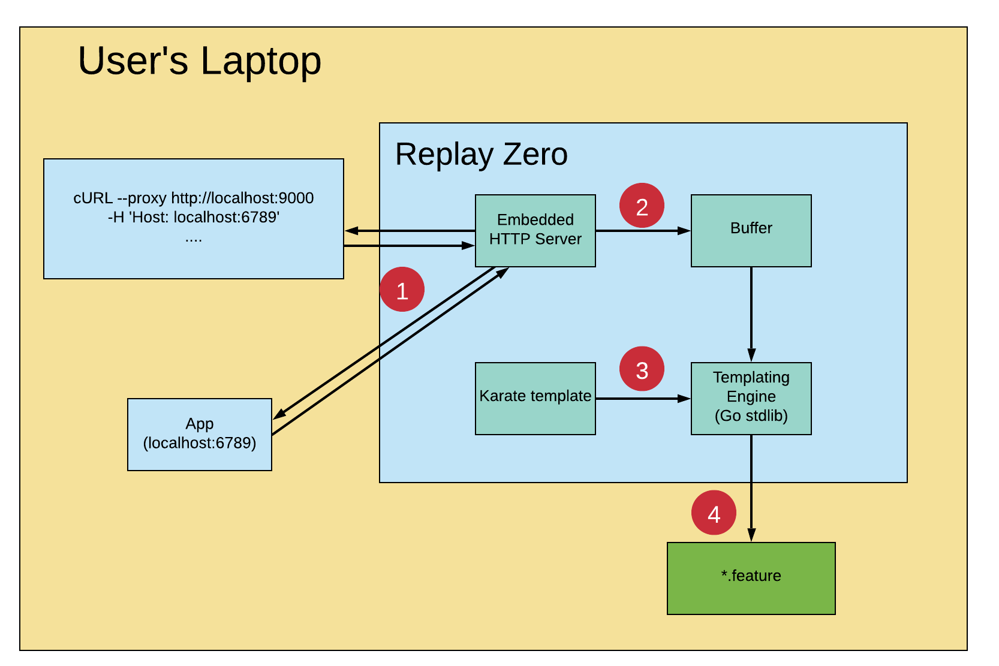
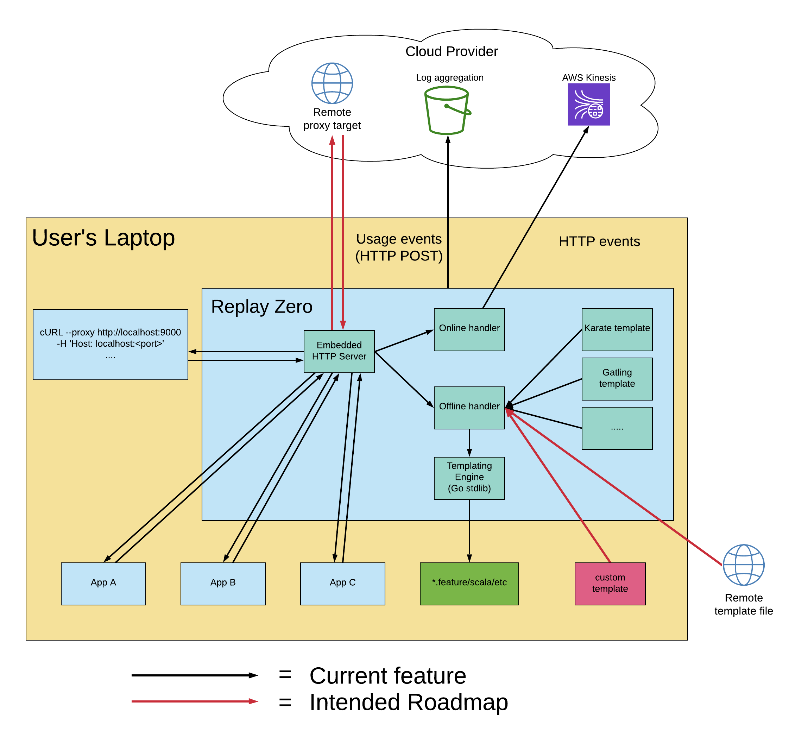

<div align="center">
  
</div>

[](https://circleci.com/gh/intuit/ReplayZero)
[](https://img.shields.io/github/go-mod/go-version/intuit/replayzero)
[](https://goreportcard.com/report/github.com/intuit/replayzero)
[](https://opensource.org/licenses/Apache2.0)

A lightweight, localized interface to API recording and test generation. Automatically turn local web traffic from __*your application*__ into functional test scenarios. Replay Zero generates [Karate](https://intuit.github.io/karate/) scenarios by default, but the generation process utilizes a templating engine that allows extension to any HTTP-based test format.

**NOTE:** Replay Zero may be a web proxy, but **DO NOT USE IN PRODUCTION... yet.** This tool was originally made specifically with a developer laptop as the target environment (this can be seen in sample flows below), and should only be viewed as a developer productivity / testing assistant for now.

## Installation

### Homebrew

```sh
brew tap intuit/replay-zero https://github.com/intuit/ReplayZero
brew install replay-zero
```

### Release builds

Binaries are built + attached to releases for Linux, MacOS and Windows.

```sh
# Download a platform specific build
curl -vkL https://github.com/intuit/ReplayZero/releases/download/v0.0.2/replay-zero-osx.zip
# Unpack && rename
unzip replay-zero-osx.zip && mv ./replay-zero-osx ./replay-zero
# Make executable
chmod a+x ./replay-zero
```

## Quickstart

### How does it work

1. HTTP requests are proxied through an embedded web server
1. Request + response data (URI, headers, payloads, response code) are collected and buffered
1. Upon buffer flush, HTTP data is sent through a templating engine and converted into Karate scenarios
1. Test contents are written to files on disk



## Start Recording

1. Start the tool with no arguments, containing the web proxy that listens on `localhost:9000` and forwards (by default) to `localhost:8080`, where your app will run.

```sh
replay-zero
```

1. In another terminal tab, download and start a dummy echo server on port 8080.

```sh
npm install http-echo-server -g
http-echo-server 8080
```

1. Send some requests via curl, specifying Replay Zero as a proxy.

```sh
curl --proxy http://localhost:9000 -H 'my_header: some_value' localhost:8080/sample/api
```

1. Shut down Replay Zero with `Ctrl + C` in the same terminal tab you started it in. Do the same for the echo server if you started that as well.

## Streaming Mode

Instead of saving events locally, Replay Zero can also stream recorded request/response pairs to an [AWS Kinesis data stream](https://aws.amazon.com/kinesis/data-streams/) if you want to set up remote processing/storage.

To enable streaming mode

1. Have valid AWS credentials for your Kinesis stream in either environment variables or a shared credentials file (see FAQ below for more)
1. Pass in values to the following flags
   * `-s` / `--stream-name` - name of Kinesis stream
   * `-r` / `--stream-role-arn` - full IAM role ARN (`arn:aws:iam::<account>:role/...`) for a role that must allow at least the `kinesis:PutRecord` and `kinesis:DescribeStream` actions

### Security

The AWS SDK provides in-transit encryption for API transactions (like the Kinesis `PutRecord` API used to send telemetry). However, Kinesis messages are by default unencrypted at rest while waiting to be consumed from the stream (24 hours by default). Kinesis does offer Server-Side Encryption (SSE) which can be enabled with a default or custom KMS master key.

We recommend enabling Kinesis SSE so that your recorded traffic will not be visible until it is consumed by whatever Kinesis consumer you implement. When provided a valid stream name and IAM role, Replay Zero will call the `kinesis:DescribeStream` API and log a warning if SSE is disabled for that stream (but will still record + send data to the stream).

See the AWS docs on [Kinesis SSE](https://docs.aws.amazon.com/streams/latest/dev/getting-started-with-sse.html) to learn more.

## Additional Features

### Configure Proxy targets

#### Default target port

By default, all events Replay Zero receives will be proxied to `localhost:8080`. The default target port can be changed with the `--target-port` flag

```sh
replay-zero --target-port=8575
```

#### Proxy to multiple targets

By reading the contents of the `Host` header, Replay Zero can rewrite the proxy target on a per-request basis. Certain tools will do this for you (like the above methods for configuring a proxy using cURL or Postman). If you are sending your requests to be proxied some other way, as long as the `Host` header is set with the right localhost target each request will be dynamically rerouted to the right location. Now's a good time to remind that current only localhost / HTTP traffic is supported for proxying.

### Request Batching

Running `replay-zero` with no arguments causes each request/response pair to be written to its own Karate `*.feature` file. But there are several ways to configure consecutive events to be written to the same file.

Things to keep in mind:

* When stopping Replay Zero via `Ctrl+C`, if there are any events left in the buffer they will also be written out so that no data will ever be lost

#### Fixed Batch Size

Pass in an extra `--batch-size <n>` flag that will buffer multiple requests before writing them out. This batch size will be fixed for the duration that Replay Zero is running, and will require a shutdown to change.

#### All-in-one Batch

If you'd like to simply start Replay Zero and have it buffer _everything_ until you shut it down and write all recorded events into 1 big file, pass in any negative batch size:

```sh
replay-zero --batch-size=-1
```

#### Dynamic Batch Size

Say you want to record 2 API flows in your app, one which involves 3 sequential API calls and the other requires 5. Instead of turning on Replay Zero once with `--batch-size=3` and again with `--batch-size=5`, pass an extra header in the *first request* of each flow that looks like `'replay_batch: N'`. Whenever Replay Zero receives a request with this header, it will change its batch size to a valid integer in the header value. After that batch is processed, it will fall back to the default (either the value you passed in `--batch-size` or 1 as a fallback). If a dynamic batch size is received, the event buffer will be flushed to a file so that recorded data will not be lost.

Via cURL, this scenario could look like (with some very complex sequential calls)

```sh
 $ curl -H 'replay_batch: 3' localhost:8080/my/api
hello! here is some data - 123
 $ curl localhost:8080/my/api
hello! here is some data - 456
 $ curl localhost:8080/my/api
hello! here is some data - 789
$ curl -H 'replay_batch: 5' localhost:8080/some/other/api
abc - here is some other data
$ curl localhost:8080/some/other/api
def - here is some other data
$ curl localhost:8080/some/other/api
ghi - here is some other data
$ curl localhost:8080/some/other/api
jkl - here is some other data
$ curl localhost:8080/some/other/api
mno - here is some other data
```

And Replay Zero's output would look something like

```text
Starting nginx + log forwarder
2020/01/16 03:02:33 Running OFFLINE, writing out events to Karate scripts
2020/01/16 03:02:58 Saw event:
a41555fb22543469d126719292390820 GET /my/api
2020/01/16 03:02:58 Collecting dynamic batch size with size 3
2020/01/16 03:03:10 Saw event:
813812b835b4f900f3e6ea7eb7af624a GET /my/api
2020/01/16 03:03:14 Saw event:
5dec9aa40573522fa41966dfbf0e753b GET /my/api
2020/01/16 03:03:14 Wrote 3 scenarios to file replay_scenarios_1.feature
2020/01/16 03:03:35 Saw event:
42c9e477621bc65ac2918ebbfc2f6644 GET /some/other/api
2020/01/16 03:03:35 Collecting dynamic batch size with size 5
2020/01/16 03:03:46 Saw event:
d52734b60a30ba2032edcd4c11e4eb00 GET /some/other/api
2020/01/16 03:03:48 Saw event:
ee87ba117b2ba079dd194b53a8005891 GET /some/other/api
2020/01/16 03:03:49 Saw event:
5330a9b0b1e449e762575bfa97528e4e GET /some/other/api
2020/01/16 03:03:49 Saw event:
e46bfc69b893b659c4db713ba2cc84f1 GET /some/other/api
2020/01/16 03:03:49 Wrote 5 scenarios to file replay_scenarios_2.feature
```

### Different output formats

By default Replay Zero generates Karate `*.feature` files and outputs them to the directory Replay Zero was started in. But the `--output` flag allows you to specify the format you'd like your tests to be generated in. The created files will always following the naming format `replay_scenarios_{N}.{extension}`. Currently the supported test formats are

* Karate  (`*.feature`)
* Gatling (`*.scala`)

Specify the output as a lowercase input to the flag:

```sh
replay-zero --output=gatling
```

## Roadmap

Replay Zero has many plans for improvement which you can find in the Issues tab of this repo. Now that you've read the entire README up until this point (right?) and know of all the features Replay Zero offers, here is a visual recap of both some of the features currently provided (multiple target proxying, output templating) as well as some planned roadmap items (remote proxyingm, custom template sourcing) and how they may fit in alongside existing features.



## FAQ

### Q: _My app is running on a port other than 8080._

A: See the "Additional Features" section "Configure Proxy targets" on how to define the target port both globally or per-request.

### Q: _When I run Replay Zero in streaming mode and try to record something, an error about credentials shows up._

(Something like this)

```plain
2019/12/31 00:48:40 NoCredentialProviders: no valid providers in chain
caused by: EnvAccessKeyNotFound: failed to find credentials in the environment.
SharedCredsLoad: failed to load profile, .
EC2RoleRequestError: no EC2 instance role found
caused by: RequestError: send request failed
```

A: Check that either

* you have valid AWS credentials under the right profile in the file `~/.aws/credentials`
* the following environment variables are set in your current shell
  * `AWS_ACCESS_KEY_ID`
  * `AWS_SECRET_ACCESS_KEY`
  * `AWS_SESSION_TOKEN` (optional)

## Telemetry

This tool supports sending usage metrics to an [Amazon Kinesis data stream](https://aws.amazon.com/kinesis/data-streams/), but this is **completely disabled** in the open source repo - there's no URL set to send data to. If you want to use this for internal reporting, set the environment variables

* `REPLAY_ZERO_TELEMETRY_STREAM` (stream name)
* `REPLAY_ZERO_TELEMETRY_ROLE` (IAM role to assume credentials for writing to the stream)

The code for this is in [`telemetry.go`](./telemetry.go) - take a look if you're curious or concerned.

### Security

The AWS SDK provides in-transit encryption for API transactions (like the Kinesis `PutRecord` API used to send telemetry). However, Kinesis messages are by default unencrypted at rest while waiting to be consumed from the stream (24 hours by default). Kinesis does offer Server-Side Encryption (SSE) which can be enabled with a default or custom KMS master key.

We recommend enabling Kinesis SSE so that your telemetry logs will not be visible until it is consumed by whatever Kinesis consumer you implement. When provided a valid stream name and IAM role, Replay Zero will call the `kinesis:DescribeStream` API and log a warning if SSE is disabled for that stream (but will still record + send data to the stream).

See the AWS docs on [Kinesis SSE](https://docs.aws.amazon.com/streams/latest/dev/getting-started-with-sse.html) to learn more.

## Developing

### Requirements

* [Go 1.13.x](https://golang.org/doc/install)
* [golangci-lint](https://github.com/golangci/golangci-lint#install) for linting + static analysis

### Basics

* Running `make` will build the tool for Mac, Linux, and Windows.
* Running `make test` will run tests
* Running `make coverage` will run tests, save the coverage, and then open your browser to the coverage report

### Kinesalite

For both streaming recording and telemetry messages, Replay Zero uses Amazon Kinesis. To test out Kinesis functionality locally, the tool [Kinesalite](https://github.com/mhart/kinesalite) provides a lightweight implementation that works well in a dev environment but can interact with the AWS Kinesis API's.

If you'd like to test your own consumer of either Replay Zero streaming data or telemtry,

1. Follow the Kinesalite docs to install then start it on `https://localhost:4567`
1. When specifying the stream name for Replay Zero set the stream name to `replay-zero-dev` and a special client will be constructed to connect to Kinesalite. Replay Zero will not try to assume an IAM role for credentials with this client.
    * Stream name for HTTP data: `-s` / `--stream-name` flag
    * Stream name for telemetry: `REPLAY_ZERO_TELEMETRY_STREAM` environment variable

## Contribution Guidelines

See the .github/CONTRIBUTING.md file.

## Builds

See the [releases](https://github.com/intuit/replay-zero/releases) page for pre-built binaries.

## License

[Apache 2.0](./LICENSE)
